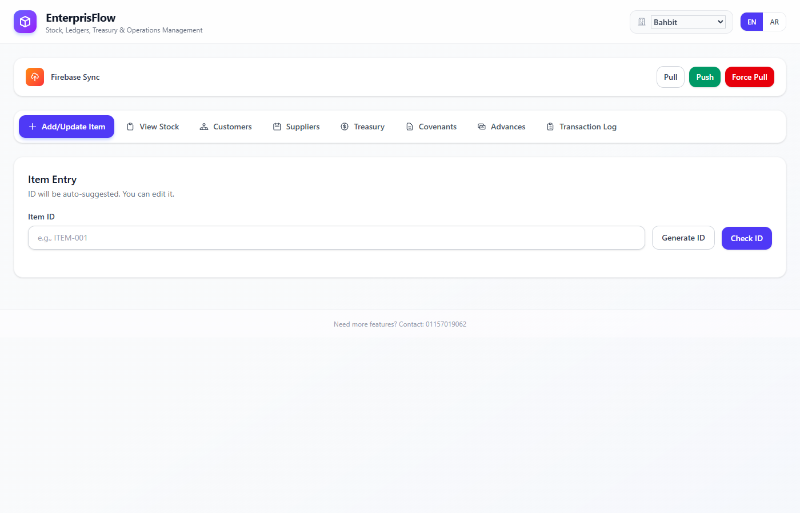
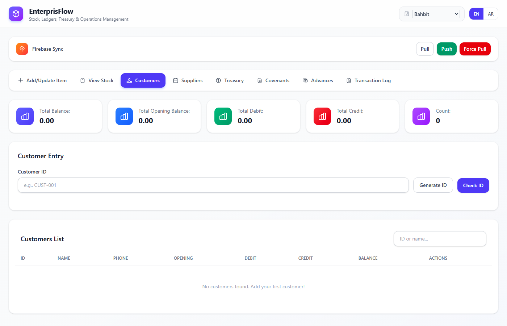
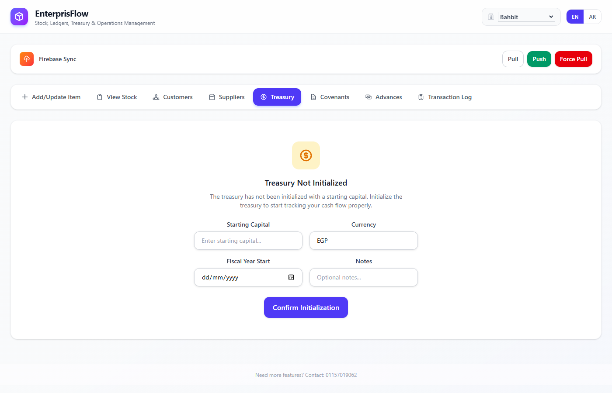
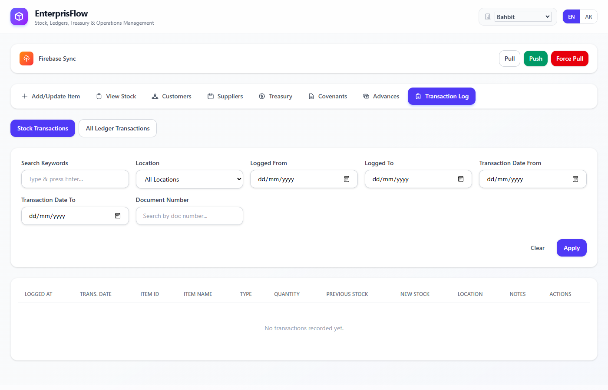
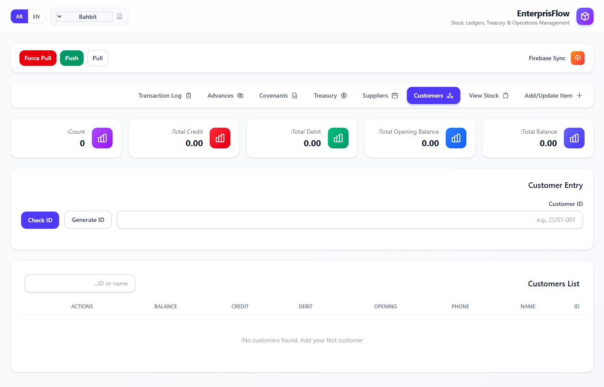

# EnterprisFlow

**Warehouse stock, financial ledger, and treasury management** — a desktop application built with Laravel, React, and NativePHP Electron.



## Features

- **Stock Management** — Add, update, and track inventory items across multiple factory locations. Supports incoming, outgoing, and internal transfer operations.
- **Customer & Supplier Ledgers** — Manage debit/credit balances, opening balances, and full transaction histories per entity.
- **Treasury** — Initialize with starting capital, manage multiple accounts, and track all cash flow with debit/credit operations.
- **Covenants & Advances** — Track employee covenants and salary advances with full ledger support.
- **Transaction Log** — Searchable, filterable history of all stock and ledger operations with reversal support.
- **Firebase Cloud Sync** — Manual push/pull/force-pull synchronization with Firestore for multi-device data sharing.
- **Bilingual (EN/AR)** — Full English and Arabic support with automatic RTL layout switching.
- **Desktop App** — Ships as a native Windows `.exe` via NativePHP Electron with auto-updates from GitHub Releases.

## Screenshots

### Customer Ledger
Stat cards showing totals, customer entry form, and searchable customer list.



### Treasury Management
Initialize treasury with starting capital, currency, and fiscal year settings.



### Transaction Log
Filter by keywords, location, date range, and document number across stock and ledger transactions.



### Arabic RTL Support
Full right-to-left layout with Arabic translations.



## Tech Stack

| Layer | Technology |
|-------|-----------|
| Backend | Laravel 12, PHP 8.3+ |
| Frontend | React 19, TypeScript, Inertia.js |
| Styling | Tailwind CSS v4 |
| Desktop | NativePHP Electron |
| Database | SQLite |
| Cloud Sync | Firebase Firestore |
| Build/CI | GitHub Actions |

## Getting Started

### Prerequisites

- PHP 8.3+
- Composer
- Node.js 22+
- npm

### Installation

```bash
# Clone the repo
git clone https://github.com/SacreddPotato/ERP.git
cd ERP

# Install dependencies
composer install
npm install

# Configure environment
cp .env.example .env
php artisan key:generate

# Create database
touch database/database.sqlite
php artisan migrate

# Build frontend
npm run build

# Start the app
php artisan serve
```

### Development

```bash
# Run Laravel dev server and Vite in parallel
php artisan serve &
npm run dev
```

### Desktop Build

```bash
# Build a Windows .exe
php artisan native:build win
```

The built executable will be in the `dist/` directory.

## Configuration

### Firebase Sync

Place your Firebase service account JSON file in the project root and set in `.env`:

```env
FIREBASE_CREDENTIALS=firebase-service-account.json
FIREBASE_PROJECT_ID=your-project-id
```

### Auto-Updater

The desktop app auto-updates from GitHub Releases. Configure in `.env`:

```env
NATIVEPHP_UPDATER_ENABLED=true
NATIVEPHP_UPDATER_PROVIDER=github
GITHUB_REPO=ERP
GITHUB_OWNER=SacreddPotato
```

### Releasing a New Version

Tag and push to trigger the build workflow:

```bash
git tag v1.0.0
git push origin v1.0.0
```

GitHub Actions will build the `.exe` and create a release automatically.

## Project Structure

```
app/
├── Http/Controllers/Api/   # REST API (Stock, Ledger, Treasury, Sync, Settings)
├── Services/               # Business logic (StockService, LedgerService, etc.)
├── Models/                 # Eloquent models
└── Enums/                  # Category, Factory, Unit, etc.

resources/js/
├── Pages/Dashboard.tsx     # Main 8-tab dashboard
├── Components/
│   ├── ui/                 # Design system (Card, Button, Input, Modal, etc.)
│   ├── stock/              # Stock management components
│   ├── ledger/             # Customer/Supplier/Covenant/Advance ledger
│   ├── treasury/           # Treasury management
│   ├── transactions/       # Transaction log viewer
│   └── sync/               # Firebase sync panel
├── contexts/               # Global app context (locale, factory)
├── i18n/                   # i18next EN/AR translations
└── types/                  # TypeScript interfaces
```

## License

Private. All rights reserved.
